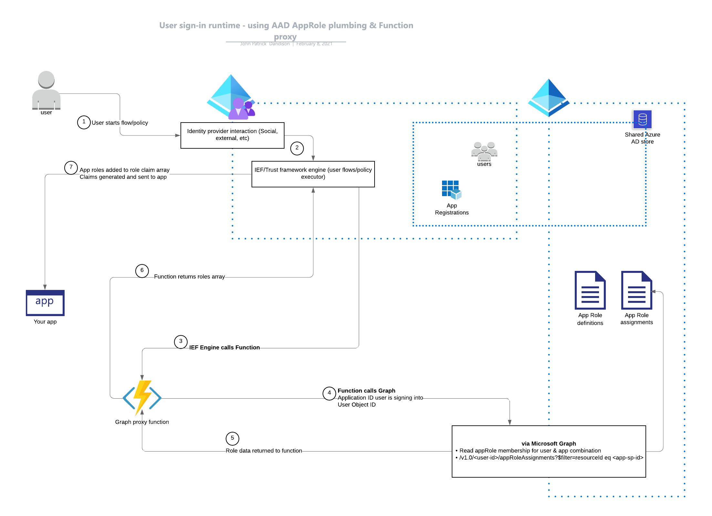
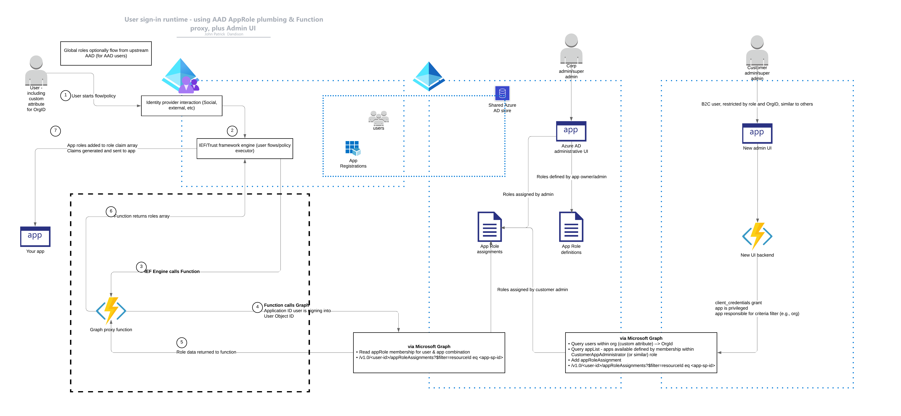

# Using App Roles in Azure AD B2C

⚠️ this repo is not ready for use ⚠️

A project for building a basic role-based authorization system using existing Azure AD primitives. Storage and top-level administration is handled via the Azure AD AppRole system. At sign-in time, roles assignments are fetched via Graph and pushed into the claimset before being sent back to the client. This also provides facilities for delegating user adminstration to customer administrators. Contributions are welcome!

There are two primary components: plumbing for fetching & injecting claims and an administrative interface with more granularity than normal AAD can provide.

## plumbing; aka, getting a `roles` claim into the claimset

Ideally, we use a combination of Graph and B2C custom policy for interrogating AAD, getting the user's role memberships and injecting them at sign-in time. The long-term plan is to use B2C custom policy and a direct connection to the Graph API. This has a few distinct advantages:

- No external compute required (e.g., a web api, Azure Function, etc)
- Nothing to scale or keep operational
- No data to store
- Fast 🚀

As of now, Graph calls are proxied via an Azure Function until the correct `ClaimsTransformation`s can be built in custom policy. Proxying does offer its own set of advantages:

- Flexible
- Durable against downstream API changes
- Useful for calling additional APIs (e.g., a business system or supplementary authorization system)
- More caching/resiliency options

## Graph authorization

Regardless of the mechanism to connect to Graph (either directly or via proxy), Graph authorization is done via `client_credentials` - which means credentials should (as always) be handled with care. The permissions on these credentials are moderately privileged.

Plumbing roles:

- [`Applications.Read.All`](https://docs.microsoft.com/en-us/graph/api/serviceprincipal-get?view=graph-rest-1.0&tabs=http) - for retrieving app data at sign-in time
- [`AppRoleAssignment.Read.All`](https://docs.microsoft.com/en-us/graph/api/serviceprincipal-list-approleassignments?view=graph-rest-1.0&tabs=http) - for retrieving app role assignments

Adminstrative UI roles:

- [`AppRoleAssignment.ReadWrite.All`](https://docs.microsoft.com/en-us/graph/api/serviceprincipal-post-approleassignments?view=graph-rest-1.0&tabs=http) - for managing app role assignments
- [`User.Read.All`](https://docs.microsoft.com/en-us/graph/api/user-list?view=graph-rest-1.0&tabs=http) - for querying users, e.g., 'the people picker'

Optional admin UI permissions:

- [`Application.ReadWrite.All`](https://docs.microsoft.com/en-us/graph/api/application-update?view=graph-rest-1.0&tabs=http) - for creating new app roles (e.g., allowing a delegated administrator to create new app roles)
- [`GroupMember.Read.All`](https://docs.microsoft.com/en-us/graph/api/group-list-members?view=graph-rest-1.0&tabs=http) - for assigning groups to roles

These permissions can be on the same application registration, or preferably on two different app registrations - one for reading role data, the other for administration. Note that these are *application* permissions, not user-delegated permissions. The users of this portal with be authorized separately via an app role membership (see below).

## delegated role administration UI

As Azure AD's built-in role administration isn't granular enough (alternatively, making it work would require a lot of role in/out and a ton of code), we need to build an administrative UI for admins of various levels to administer different subsets of users based on various criteria. For example, say Fabrikam is a SaaS provider which sells software to organizations. Contoso is a customer.

- I am an administrator at Fabrikam
  - My Azure AD roles allow me to do everything: change user membership, add/remove AppRoles and register apps, which I do through the normal Azure AD portal
- I am an application owner at Fabrikam (provider)
  - I am allowed to define roles for applications for which I am a member of the 'ApplicationAdministrator' role
    - these roles are saved into the specific application registration's `appRoles` collection
  - I am allowed to invite users from any organization*
- I am an employee of Contoso (customer), the first one to use Fabrikam's app.
  - My organization has an auto-generated ID (123)
  - I am only allowed to search for other Contoso users (e.g., `organization_id == 123`)
  - I am only allowed to assign roles to other Contoso users (e.g., `organization_id == 123`)

>ℹ️ Notes on above
>
> The 'ApplicationAdministrator' role is an arbitrary role - the name doesn't matter, provided it is consistent.
> Invitations need a design - presumably an allow-list of domains <-> organization IDs

## work to do

- figure out the correct `ClaimsTransformation` for parsing Graph data without external compute
- deployment template (e.g., 'configure my tenant')
- delegated admin UI
- design the invite system
